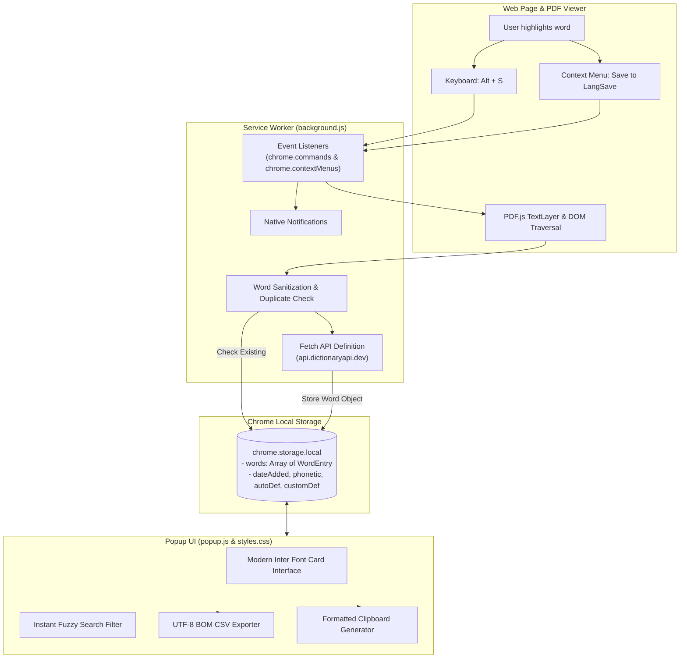

# 📖 LangSave — Seamless Vocabulary Builder & Anki Exporter

<p align="center">
  
  
  
  
  
  
  
</p>

> **Effortlessly capture, learn, and retain new English vocabulary directly while reading web articles, documentation, and PDF documents.**  
> Automatically fetches IPA phonetics, definitions, and exports seamlessly to **Anki Flashcards** and CSV.

---

## 📌 Table of Contents / Mục Lục

- [The Problem & The Solution / Vấn Đề & Giải Pháp](#-the-problem--the-solution)
- [Key Features / Tính Năng Nổi Bật](#-key-features--tính-năng-nổi-bật)
- [Architecture & Tech Stack / Kiến Trúc Kỹ Thuật](#-architecture--tech-stack)
- [Installation Guide / Hướng Dẫn Cài Đặt](#-installation-guide--hướng-dẫn-cài-đặt)
- [How to Use / Hướng Dẫn Sử Dụng](#-how-to-use--hướng-dẫn-sử-dụng)
- [Exporting to Anki / Hướng Dẫn Xuất Thẻ Anki](#-exporting-to-anki--hướng-dẫn-xuất-thẻ-anki)
- [Privacy & Permissions / Quyền Riêng Tư & Bảo Mật](#-privacy--permissions)
- [Roadmap / Lộ Trình Phát Triển](#-roadmap--lộ-trình-phát-triển)
- [Author & Links / Tác Giả & Liên Hệ](#-author--links--tác-giả--liên-hệ)

---

## 💡 The Problem & The Solution

### The Friction (Vấn đề người học gặp phải)
Khi đọc báo tiếng Anh (BBC, The Guardian, Medium) hoặc tài liệu chuyên ngành PDF:
1. **Mất tập trung (Context Switching)**: Gặp từ mới phải copy mở sang tab Google Translate hoặc từ điển làm đứt mạch đọc và luồng suy nghĩ.
2. **Nhanh quên (Zero Retention)**: Tra nghĩa xong nhưng không lưu lại, vài ngày sau gặp lại từ đó vẫn phải tra lại từ đầu.
3. **Mất thời gian tạo Flashcard**: Cuối tuần muốn học lại phải thủ công nhập từng từ, từng nghĩa vào Anki hoặc Quizlet rất tốn thời gian.

### The LangSave Solution (Giải pháp tối ưu)
**LangSave loại bỏ hoàn toàn mọi thao tác thừa:**
- Chỉ cần bôi đen từ và nhấn **`Alt + S`** (hoặc chuột phải chọn *"Save to LangSave"*).
- Tiện ích tự động gọi từ điển lấy **phiên âm IPA** và **định nghĩa Anh-Anh** ngay lập tức trong nền.
- Hoạt động mượt mà trên cả trang web thông thường lẫn **tài liệu PDF (Chrome PDF Viewer)**.
- Cuối tuần chỉ cần bấm **`Export Selected (CSV)`** và nhập thẳng 1-click vào **Anki** để ôn luyện theo phương pháp Lặp lại ngắt quãng (Spaced Repetition).

---

## ✨ Key Features / Tính Năng Nổi Bật

### ⚡ 1. 1-Click Instant Capture (`Alt + S`)
- Lưu từ siêu tốc chỉ với phím tắt mặc định **`Alt + S`** hoặc click chuột phải qua Context Menu.
- Thông báo Chrome Native Toast thông báo trạng thái lưu từ tức thì mà không cần mở popup.

### 📚 2. Automatic IPA Phonetics & Definitions
- Tự động gọi **Free Dictionary API** để phân tích từ gốc, lấy phiên âm chuẩn quốc tế (`[fəˈnɛtɪk]`) và định nghĩa giải thích ngắn gọn, xúc tích.
- Tự động loại bỏ dấu chấm, dấu phẩy thừa ở rìa từ bôi đen để giữ dữ liệu luôn chuẩn xác.

### 📄 3. Native PDF Viewer Support (Tính Năng Độc Đáo)
- Hầu hết các extension tra từ khác đều bị vô hiệu hóa trên trang xem PDF của trình duyệt.
- LangSave được trang bị bộ trích xuất thông minh: đào sâu vào cấu trúc **PDF.js TextLayer** và cơ chế **Clipboard Fallback** tự động, đảm bảo bạn lưu từ dễ dàng ngay cả khi đang đọc sách Ebook, Paper nghiên cứu hay tài liệu PDF học tập.

### 📝 4. Custom Personal Notes & Context
- Cho phép chỉnh sửa hoặc bổ sung câu ví dụ, ngữ cảnh sử dụng hoặc ghi chú nghĩa tiếng Việt của riêng bạn cho từng từ.
- Cơ chế **Auto-save on Blur/Enter**: Tự động lưu ghi chú ngay khi bạn rời chuột hoặc bấm Enter, không sợ mất dữ liệu.

### 📥 5. Anki-Ready & Excel CSV Export
- Xuất toàn bộ hoặc chỉ các từ được chọn ra file `.csv` có mã hóa **UTF-8 BOM**.
- Tránh hoàn toàn lỗi vỡ font tiếng Việt/ký tự đặc biệt khi mở bằng **Microsoft Excel**.
- Tương thích hoàn hảo với định dạng nhập thẻ của **Anki**, **Quizlet** và **Notion Database**.

### 📋 6. One-Click Copy All to Clipboard
- Sao chép toàn bộ danh sách từ đã lưu thành văn bản được đánh số thứ tự kèm phiên âm, định nghĩa và ghi chú cá nhân để dán nhanh vào Word, Docs hoặc tin nhắn.

### 🔍 7. Real-Time Search & Bulk Operations
- Tìm kiếm từ vựng theo thời gian thực (lọc theo từ gốc, định nghĩa hoặc ghi chú cá nhân).
- Nút bấm tiện lợi: **Select All**, **Expand All**, **Collapse All**, và **Delete Selected** hàng loạt.

---

## 🏗️ Architecture & Tech Stack

LangSave được xây dựng theo chuẩn **Google Chrome Manifest V3**, cam kết tối đa hóa hiệu năng và tiết kiệm pin:



### Chi tiết công nghệ:
- **Manifest Version**: Manifest V3 (chuẩn mới nhất của Google Chrome, tối ưu hóa RAM và vòng đời tiến trình).
- **Core Scripting**: Vanilla JavaScript (ES6+), Clean Architecture, không cần bundler cồng kềnh.
- **Chrome APIs sử dụng**:
  - `chrome.contextMenus`: Tích hợp menu chuột phải tiện lợi.
  - `chrome.commands`: Lắng nghe phím tắt toàn cầu `Alt + S`.
  - `chrome.storage.local`: Lưu trữ dữ liệu an toàn, bền bỉ ngay trên máy người dùng.
  - `chrome.scripting`: Thực thi script trích xuất văn bản nâng cao trên các tab PDF.
  - `chrome.notifications`: Gửi phản hồi thông báo tức thì khi lưu từ.
- **External API**: [Free Dictionary API](https://dictionaryapi.dev/) (mã nguồn mở, không cần API Key).

---

## 🛠️ Installation Guide / Hướng Dẫn Cài Đặt

### Cài Đặt Dạng Developer Mode (Trải Nghiệm Ngay Trong 1 Phút)

1. **Tải mã nguồn về máy**:
   ```bash
   git clone https://github.com/Charonart/LangSaveExtension.git
   ```
2. **Mở trang quản lý tiện ích trên trình duyệt**:
   - Truy cập vào đường dẫn: **`chrome://extensions/`** (hoặc `edge://extensions/` trên Microsoft Edge).
3. **Bật chế độ nhà phát triển**:
   - Gạt công tắc **Developer mode** (Chế độ dành cho nhà phát triển) ở góc trên bên phải sang **ON**.
4. **Tải tiện ích vào trình duyệt**:
   - Nhấn vào nút **Load unpacked** (Tải tiện ích đã giải nén).
   - Chọn thư mục `LangSave` trên máy tính của bạn.
5. **Ghim tiện ích**:
   - Nhấn vào biểu tượng mảnh ghép (Extensions) trên thanh công cụ của Chrome và bấm **Ghim (Pin)** LangSave để dễ dàng mở popup!

---

## 📖 How to Use / Hướng Dẫn Sử Dụng

| Thao Tác | Phím Tắt / Hành Động | Kết Quả |
| :--- | :--- | :--- |
| **Lưu từ nhanh** | Bôi đen từ $\rightarrow$ Bấm **`Alt + S`** | Lưu từ, tự động tra phiên âm, định nghĩa và hiện thông báo góc màn hình |
| **Lưu qua chuột phải** | Bôi đen từ $\rightarrow$ Chuột phải $\rightarrow$ Chọn **"Save to LangSave"** | Lưu từ và cập nhật danh sách |
| **Thêm ghi chú riêng** | Mở popup $\rightarrow$ Bấm vào ô **Your notes** | Tự động lưu ghi chú khi gõ xong hoặc bấm Enter |
| **Tìm kiếm từ** | Nhập từ khóa vào thanh search | Lọc từ tức thì theo từ vựng, phiên âm hoặc ghi chú |
| **Xuất ra Anki/Excel** | Chọn các từ (hoặc bấm Select All) $\rightarrow$ Bấm **Export Selected** | Tải xuống file `.csv` chuẩn UTF-8 BOM |

> 💡 **Mẹo đổi phím tắt**: Nếu bạn muốn đổi `Alt + S` sang phím khác (ví dụ: `Ctrl + Shift + S`), bạn chỉ cần truy cập: **`chrome://extensions/shortcuts`** và thiết lập phím tắt mong muốn cho LangSave.

---

## 🎴 Exporting to Anki / Hướng Dẫn Xuất Thẻ Anki

File CSV của LangSave được thiết kế tương thích 100% với ứng dụng học từ vựng **Anki**:

1. Mở popup LangSave, nhấn **Select All** (hoặc tích chọn các từ bạn muốn học) rồi nhấn **`Export Selected`**.
2. Mở ứng dụng **Anki** trên máy tính của bạn.
3. Chọn menu **File** $\rightarrow$ **Import...** $\rightarrow$ Chọn file CSV vừa tải về từ LangSave.
4. Thiết lập ánh xạ các trường (Field Mapping) trong Anki:
   - **Field 1 (Word)** $\rightarrow$ Mặt trước (Front)
   - **Field 2 (Phonetic)** $\rightarrow$ Phiên âm IPA
   - **Field 3 (Auto-Definition)** $\rightarrow$ Mặt sau / Định nghĩa (Back / Meaning)
   - **Field 4 (Custom-Definition)** $\rightarrow$ Ghi chú / Ví dụ cá nhân (Notes / Example)
5. Nhấn **Import** — Toàn bộ từ vựng mới đã sẵn sàng cho bạn ôn luyện mỗi ngày!

---

## 🔒 Privacy & Permissions / Quyền Riêng Tư & Bảo Mật

LangSave tôn trọng tuyệt đối quyền riêng tư của bạn:

- 🛡️ **100% Local Storage**: Tất cả từ vựng bạn lưu trữ đều nằm trong `chrome.storage.local` trên chính thiết bị của bạn.
- 🚫 **No Tracking / No Analytics**: Tiện ích không thu thập dữ liệu hành vi, không gắn mã theo dõi của bên thứ ba.
- 🔑 **No Sign-Up Required**: Cài đặt là dùng ngay, không yêu cầu tạo tài khoản hay cung cấp email.
- 🌐 **Network Usage**: Tiện ích chỉ gửi duy nhất một yêu cầu HTTP GET đến `api.dictionaryapi.dev` khi bạn chủ động lưu từ để lấy thông tin giải nghĩa từ điển.

---

## 🗺️ Roadmap / Lộ Trình Phát Triển

- [x] Manifest V3 Architecture & Service Worker Lifecycle
- [x] Phím tắt `Alt + S` & Context Menu
- [x] Hỗ trợ trích xuất text trong Chrome PDF Viewer
- [x] Tự động tra nghĩa & phiên âm qua Dictionary API
- [x] Xuất file CSV chuẩn UTF-8 BOM cho Anki/Excel
- [ ] 🔊 **Audio TTS Pronunciation**: Phát âm giọng bản xứ trực tiếp trong popup
- [ ] 🔄 **Direct AnkiConnect Integration**: Đồng bộ 1 chạm trực tiếp vào Anki Desktop không cần tải file CSV
- [ ] 🌐 **Multi-Language Support**: Bổ sung từ điển dịch tự động Anh - Việt (Google Translate / DeepL integration)
- [ ] ☁️ **Cloud Sync Option**: Tùy chọn đồng bộ Google Drive hoặc Notion cá nhân

---

## 👨‍💻 Author & Links / Tác Giả & Liên Hệ

- **Project Lead & Developer**: **Lê Bá Quý** ([Charonart](https://github.com/Charonart) / Lê Quý)
- **Repository**: [https://github.com/Charonart/LangSaveExtension](https://github.com/Charonart/LangSaveExtension)
- **Report Bugs & Feedback**: [GitHub Issues](https://github.com/Charonart/LangSaveExtension/issues)

---

<p align="center">
  <i>Developed with precision for language learners, readers, and knowledge seekers.</i>
</p>
