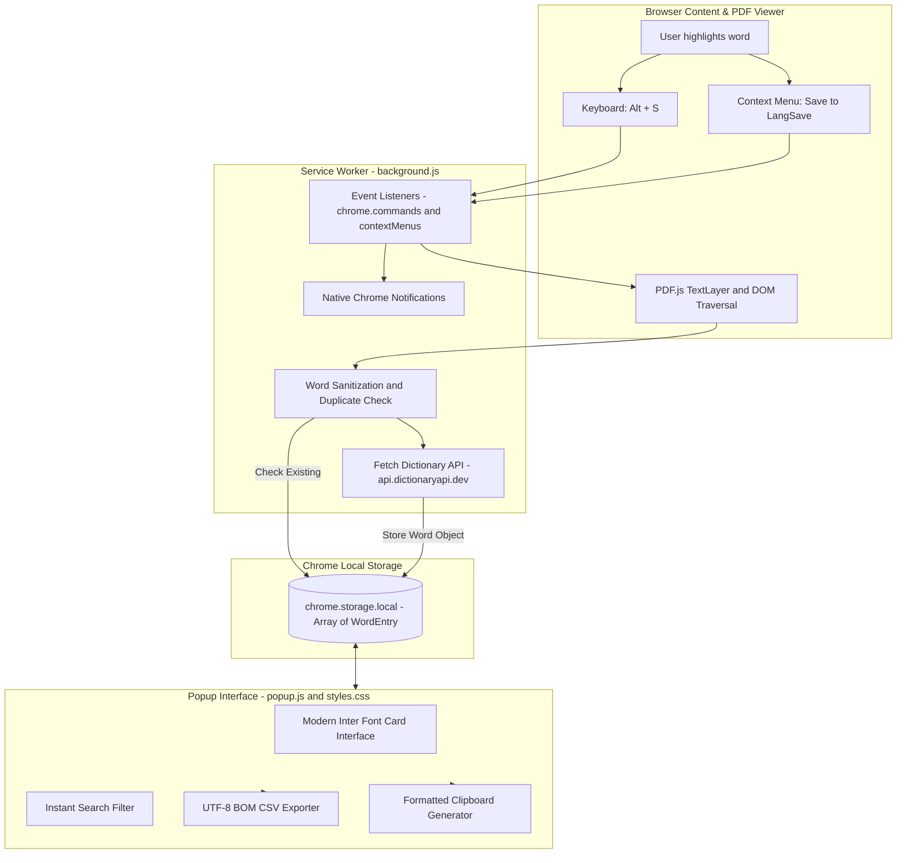

# 📖 LangSave — Seamless Vocabulary Builder & Anki Exporter

<p align="center">
  
  
  
  
  
  
  
</p>

> **Effortlessly capture, learn, and retain new English vocabulary directly while reading web articles, technical documentation, and PDF documents.**  
> Automatically fetches IPA phonetics, definitions, and exports seamlessly to **Anki Flashcards** and spreadsheet formats.

---

## 📌 Table of Contents

- [The Problem & The Solution](#-the-problem--the-solution)
- [Key Features](#-key-features)
- [Architecture & Technical Implementation](#-architecture--technical-implementation)
- [Installation Guide (Developer Mode)](#-installation-guide-developer-mode)
- [How to Use](#-how-to-use)
- [Exporting to Anki Flashcards](#-exporting-to-anki-flashcards)
- [Privacy & Security](#-privacy--security)
- [Roadmap](#-roadmap)
- [Author & Contact](#-author--contact)

---

## 💡 The Problem & The Solution

### The Friction (The Reading Dilemma)
When reading online articles (BBC, The Guardian, Medium, Substack) or academic/technical PDFs:
1. **Context Switching & Disrupted Flow**: Encountering an unfamiliar word forces you to open a new tab for Google Translate or a dictionary, breaking your concentration and reading momentum.
2. **Zero Retention**: You look up a definition, understand it in the moment, but forget it within days because you didn't save it anywhere.
3. **Tedious Flashcard Creation**: Manually copy-pasting words, phonetics, and definitions into Anki or Quizlet at the end of the week is repetitive and time-consuming.

### The LangSave Solution
**LangSave eliminates all unnecessary friction:**
- Simply highlight any word and press **`Alt + S`** (or right-click and select *"Save to LangSave"*).
- The extension runs in the background to fetch **IPA phonetics** and **concise English definitions** via the Free Dictionary API.
- Works natively across regular web pages as well as **Chrome's built-in PDF Viewer**.
- Review words anytime in a clean popup, add your personal notes, and click **`Export Selected`** to generate an Anki-ready CSV file formatted with UTF-8 BOM.

---

## ✨ Key Features

### ⚡ 1. 1-Click Instant Capture (`Alt + S`)
- Save any word in less than a second using the default keyboard shortcut **`Alt + S`** or the right-click context menu.
- A native Chrome desktop notification confirms the word is saved, so you never need to leave your reading tab.

### 📚 2. Automated IPA Phonetics & Lexical Definitions
- Automatically queries the **Free Dictionary API** to retrieve accurate international phonetics (`[fəˈnɛtɪk]`) and clean dictionary meanings.
- Automatically sanitizes selected text by trimming punctuation, quotation marks, and extraneous whitespace.

### 📄 3. Native Chrome PDF Viewer Support
- Most dictionary extensions fail inside Chrome's sandboxed PDF viewer (`chrome-extension://...` or `file://...pdf`).
- LangSave implements a specialized DOM text-layer traversal targeting **PDF.js TextLayers** with an intelligent **Clipboard Fallback**, ensuring you can save vocabulary even when reading research papers, eBooks, and whitepapers.

### 📝 4. Contextual Notes & Custom Definitions
- Add personal usage examples, mnemonics, or translations in the **Your notes** field for each saved word.
- Built-in **Auto-Save on Blur / Enter**: Changes are automatically committed to local storage without requiring a manual save button.

### 📥 5. Anki-Ready & Excel-Compatible CSV Export
- Export all saved words (or only selected items) into a standardized `.csv` file.
- Formatted with **UTF-8 BOM (Byte Order Mark)** to ensure clean rendering in Microsoft Excel without character corruption.
- Structured specifically for seamless one-click importing into **Anki**, **Quizlet**, and **Notion Databases**.

### 📋 6. One-Click Copy All to Clipboard
- Copies your entire vocabulary list as a cleanly formatted, numbered text summary containing words, phonetics, definitions, and personal notes for quick pasting into study docs or messages.

### 🔍 7. Real-Time Fuzzy Search & Bulk Operations
- Instant filtering across words, phonetics, definitions, and custom notes.
- Convenient bulk control tools: **Select All**, **Expand All**, **Collapse All**, and **Delete Selected**.

---

## 🏗️ Architecture & Technical Implementation

LangSave is built strictly upon **Google Chrome Manifest V3**, ensuring maximum performance, minimal memory footprint, and enhanced security:



### Technical Highlights:
- **Manifest V3 Compliant**: Uses an event-driven Service Worker (`background.js`) with zero persistent background memory consumption.
- **Chrome Extension APIs**:
  - `chrome.commands`: Global shortcut listener (`Alt + S`).
  - `chrome.contextMenus`: Right-click contextual integration.
  - `chrome.storage.local`: Fast, persistent, on-device key-value storage.
  - `chrome.scripting`: Dynamic script execution for PDF canvas and DOM extraction.
  - `chrome.notifications`: Non-intrusive feedback toasts.
- **External Dependency**: Zero heavy build tools or npm dependencies; pure Vanilla JavaScript (ES6+) for ultra-lightweight distribution.

---

## 🛠️ Installation Guide (Developer Mode)

You can run LangSave locally in less than 60 seconds:

1. **Clone the repository**:
   ```bash
   git clone https://github.com/Charonart/LangSaveExtension.git
   ```
2. **Open Extensions settings in Chrome**:
   - Navigate to: **`chrome://extensions/`** (or `edge://extensions/` in Microsoft Edge).
3. **Enable Developer Mode**:
   - Toggle the **Developer mode** switch in the top-right corner to **ON**.
4. **Load the Extension**:
   - Click the **Load unpacked** button.
   - Select the `LangSave` project directory on your computer.
5. **Pin the Extension**:
   - Click the puzzle piece icon on your browser toolbar and click the **Pin** icon next to LangSave for quick access!

---

## 📖 How to Use

| Action | Trigger / Shortcut | Outcome |
| :--- | :--- | :--- |
| **Instant Save** | Highlight word $\rightarrow$ Press **`Alt + S`** | Saves word, fetches phonetics & definition, shows notification |
| **Context Menu Save** | Highlight word $\rightarrow$ Right-click $\rightarrow$ **"Save to LangSave"** | Saves word and updates popup list |
| **Add Notes / Examples**| Open popup $\rightarrow$ Type in **Your notes** | Auto-saved on blur or when pressing Enter |
| **Instant Search** | Type query into search bar | Filters list in real-time by word, phonetic, or custom notes |
| **Export to Anki** | Select items (or **Select All**) $\rightarrow$ Click **Export Selected** | Downloads `.csv` file ready for Anki flashcard import |

> 💡 **Customizing Shortcuts**: If you wish to change `Alt + S` to another shortcut (such as `Ctrl + Shift + S`), visit: **`chrome://extensions/shortcuts`** in your browser.

---

## 🎴 Exporting to Anki Flashcards

LangSave CSV files are structured for direct import into [Anki Desktop](https://apps.ankiweb.net/):

1. In the LangSave popup, select the words you want to study and click **`Export Selected`**.
2. Open **Anki** on your computer.
3. Click **File** $\rightarrow$ **Import...** $\rightarrow$ Select your downloaded CSV file.
4. Set the field mapping in Anki:
   - **Field 1 (`Word`)** $\rightarrow$ Front / Word
   - **Field 2 (`Phonetic`)** $\rightarrow$ IPA Pronunciation
   - **Field 3 (`Auto-Definition`)** $\rightarrow$ Back / Meaning
   - **Field 4 (`Custom-Definition`)** $\rightarrow$ Personal Notes & Examples
5. Click **Import**. Your custom flashcard deck is ready for daily spaced repetition!

---

## 🔒 Privacy & Security

LangSave is built with a strict **Privacy-First** philosophy:

- 🛡️ **100% Local Storage**: All saved vocabulary and notes remain exclusively inside your browser's local sandbox (`chrome.storage.local`).
- 🚫 **No Tracking / Zero Telemetry**: No analytics scripts, no advertising trackers, and no third-party telemetry.
- 🔑 **No Account Required**: Ready to use immediately without registering or providing an email address.
- 🌐 **Minimal Network Footprint**: The only network request occurs when querying `api.dictionaryapi.dev` to fetch dictionary data for words you explicitly choose to save.

---

## 🗺️ Roadmap

- [x] Manifest V3 Architecture & Service Worker Lifecycle
- [x] Global Keyboard Shortcut (`Alt + S`) & Context Menu Integration
- [x] Native Chrome PDF Viewer Text Extraction
- [x] Automated IPA Phonetics & Lexical Definitions
- [x] Anki-compatible UTF-8 BOM CSV Exporter
- [ ] 🔊 **Audio TTS Pronunciation**: Native audio playback of pronunciation within popup
- [ ] 🔄 **Direct AnkiConnect Integration**: 1-click sync directly into Anki Desktop via local API
- [ ] 🌐 **Multi-Language Support**: Bilingual translation options (Google Translate / DeepL integration)
- [ ] ☁️ **Cloud Backup**: Optional synchronization with Google Drive or Notion

---

## 👨‍💻 Author & Contact

- **Lead Developer**: **Lê Bá Quý** ([Charonart](https://github.com/Charonart) / Lê Quý)
- **Repository**: [https://github.com/Charonart/LangSaveExtension](https://github.com/Charonart/LangSaveExtension)
- **Issue Tracker**: [GitHub Issues](https://github.com/Charonart/LangSaveExtension/issues)

---

<p align="center">
  <i>LangSave — Designed for readers, language learners, and curious minds.</i>
</p>
